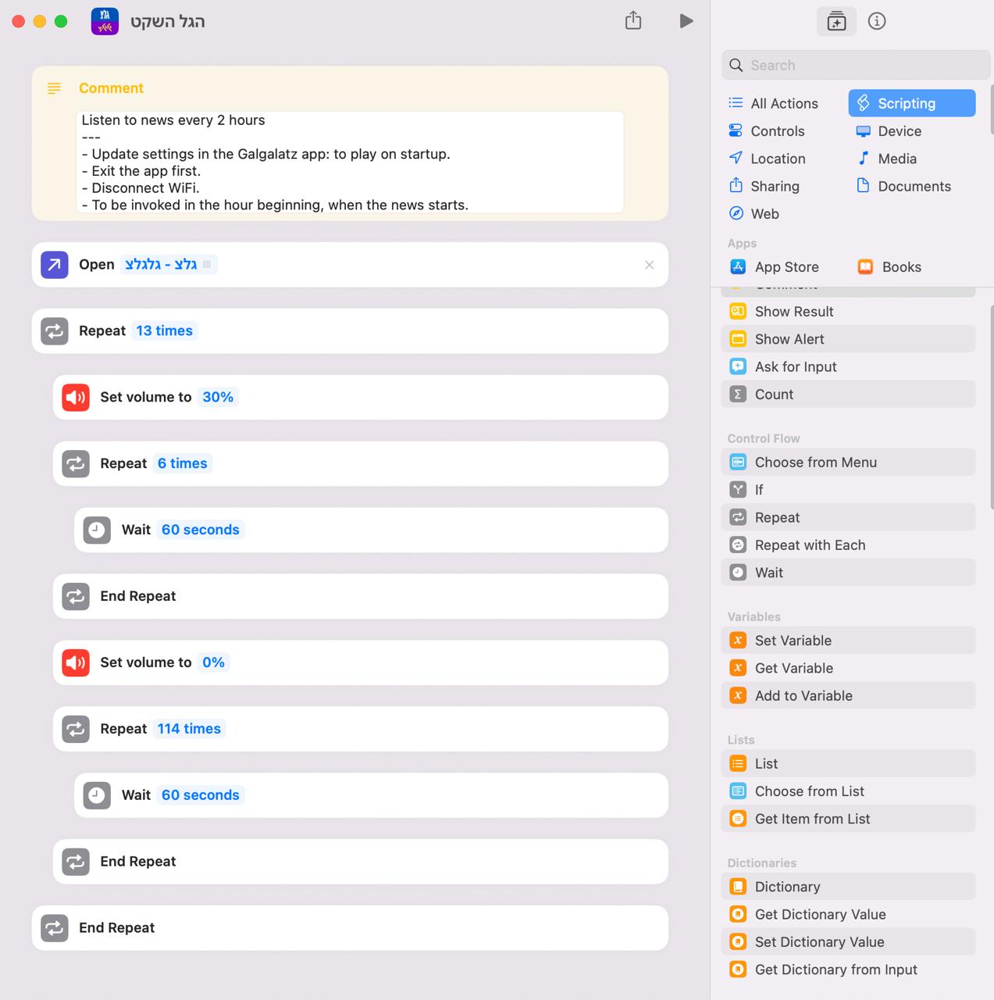

# Auto listen to radio news #

THIS IS DEPRECATED - MOBILE AUTOMATION ACHIEVES THE SAME.

As the "quiet channel" on the radio doesn't include news, allow such an ability.

- Make sure you have an internet connection the whole period (like using a HotSpot - phone connected to a power supply, not low power mode; Android dev mode - don't turn off the screen while charging)
- Disable OS sleep
- Open Run >> chrome-dev via `chrome --remote-debugging-port=9222 --user-data-dir="c:\repos\selenium\ChromeProfile"`
- Fine-tune the desired volume, by testing https://glzwizzlv.bynetcdn.com/glglz_mp3?awCollectionId=misc&awEpisodeId=glglz
- Add 'glzwizzlv.bynetcdn.com' to chrome://settings/performance --> always-on

## Future ##

- 'Smart' news stop by https://www.kan.org.il/hourly-news/
Current approach: Pros: simplicity, Cons: not being cut at the end of the news

- ~~Mobile App. For Android's Routines. Validate it's necessary as iOS, for example, has its own Shortcuts + Automations.~~

    DONE: See https://play.google.com/store/search?q=הגל%20השקט%20שלי&c=apps

- iOS example:

